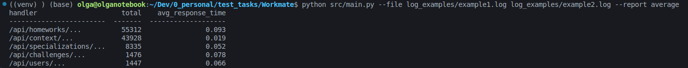

## Тестовое задание python junior. Обработка лог файла.

**Исполнитель:**  
Ольга Левадная

**Описание проекта:**  
Скрипт читает файл и формирует отчет со списком эндпоинтов, количеством запросов по каждому эндпоинту и средним временем ответа. Пути к файлам и название отчета передаются как параметры, например `python main.py --file file.log --report average`.


**Технологии:**  
- Python v. 3.12
- pytest v. 8.4.1
- tabulate v. 0.9.0
- ruff v. 0.12.9

---

**Использование:**  
1. Клонируйте репозиторий на свой компьютер.

2. Разверните и активируйте виртуальное окружение в папке проекта.

```
# Команда для Windows:
python -m venv venv
source venv/Scripts/activate

# Команда для Linux и macOS:
python3 -m venv venv
source venv/bin/activate
```

3. Установите зависимости проекта:  
`pip install -r requirements.txt`

4. Для запуска используйте команду `python main.py --file file.log --report average` из директории `src`.

---

**Пример выполнения кода на тестовых данных:**  


